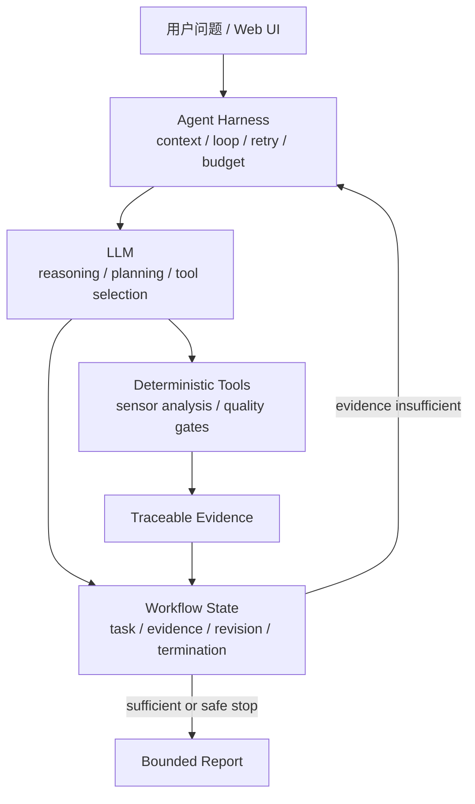

# PocketLab Public Demo

> Competition preview of an evidence-grounded agent for real-world sensor experiments.

PocketLab 把手机传感器、确定性分析工具和大模型 Agent 组合成一条可追溯的实验链：用户提出现实问题，系统生成可检验任务，调用工具分析证据，再由 Agent 根据证据决定下一步或生成带边界的报告。

这是从私密开发仓库导出的独立公开快照，不包含原仓库 Git 历史、参赛者密钥、账号数据库、真实手机数据、内部 holdout Evals、完整评测阈值、移动端工程或提交材料。

## 你可以看到什么

- Agent loop：问题理解、受约束规划、工具调用、证据解释与下一任务。
- Context engineering：案例状态、证据血缘、任务 revision 和历史恢复。
- Deterministic tools：传感器单位校验、质量门、重采样、FFT、主频、信噪比与跨条件比较。
- Workflow/state machine：唯一当前任务、单变量约束、充分度判断、动态停止和最终报告。
- Security：本地账号隔离、API Key 凭据边界、局域网 phyphox 地址校验、超时和错误脱敏。
- Observability：Agent 运行状态、耗时、重试、token/成本字段和证据审计。

## 架构



模型不直接解释高频原始传感器流。Python 工具先生成结构化指标和质量状态；只有满足来源、单位、任务和质量合同的证据才能推进状态机。

## 快速开始

要求：Python 3.11+、[uv](https://docs.astral.sh/uv/)、一个由你本人授权使用的 OpenAI-compatible 模型接口。

```powershell
git clone https://github.com/你的用户名/PocketLab-Public-Demo.git
cd PocketLab-Public-Demo
uv sync --frozen
Copy-Item .env.example .env.local
```

编辑 `.env.local`，填写你自己的配置：

```env
LLM_API_KEY=your-own-key
LLM_BASE_URL=https://your-provider.example/v1
LLM_MODEL=your-exact-model-name
LLM_REASONING_STRATEGY=auto
PORT=8000
```

启动：

```powershell
uv run python main.py
```

浏览器访问 <http://127.0.0.1:8000/>，首次使用请选择“创建账号”。账号和实验历史仅保存在本机数据库中。

完整步骤见 [QUICKSTART.md](QUICKSTART.md)。

## 推荐体验路径

为了在不连接手机的情况下查看 Agent 软件闭环，可以运行“洗衣机运行与地面振动模拟”：

1. 登录后进入“探索实验 → 自由探索 Beta”。
2. 直接审阅并填写结构化实验协议。
3. 选择“模拟演练”“依次采集”和“加速度计”。
4. 参考条件填写“洗衣机停机”，比较条件填写“洗衣机稳定运行”。
5. 每轮确认控制条件，使用“清晰条件差异”完成四轮。
6. 查看动态停止、证据轨迹和最终报告。

模拟演练会调用生产状态机、分析器和 Agent 解释链，但始终标记为 `protocol_emulator`、`physical=false`、`Gate C +0`，不能作为现实物理证据。

## 关于模型配置

仓库不会提供共享 API Key。没有模型配置时，网页、账号和协议创建可以启动，但需要模型推理的诊断和 Exploration 完整闭环不能完成。请勿把自己的 `.env.local`、Key、Cookie 或数据库提交到 Git。

## 关于 phyphox

真机采集是可选路径。手机与电脑必须位于同一可信局域网；phyphox 远程接口没有密码和加密，使用后应立即关闭。PocketLab 只接受 IP 形式的私有局域网地址以及 80/8080 端口，不会把手机地址发送给模型。

## 公开版范围

此快照聚焦 Web + Python Agent。公开数据回放包因许可证和体积边界未随仓库分发，因此相关目录可能为空；这不会影响网页启动、账号、结构化协议和模拟探索入口。详细范围见 [PUBLIC_MANIFEST.md](PUBLIC_MANIFEST.md)。

## 安全检查

```powershell
git config core.hooksPath .githooks
uv run python scripts/check_git_safety.py --tracked
uv run python scripts/run_public_smoke.py
uv run ruff check .
```

安全报告方式见 [SECURITY.md](SECURITY.md)。

## 使用边界

本仓库是 source-available competition preview，不是开放源代码发行版。仅授权克隆和运行未修改版本用于个人评估、教学查看和赛事评审；具体边界见 [EVALUATION_NOTICE.md](EVALUATION_NOTICE.md)。

PocketLab 不替代专业仪器、医疗建议或持证维修判断。报告中的现实结论必须受传感器质量、对照设计和来源范围限制。
