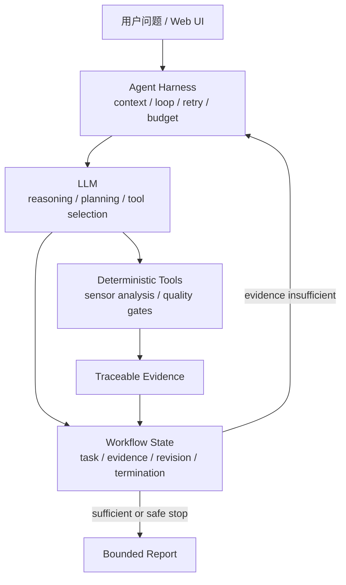

# PocketLab Public Demo

> Competition preview of an evidence-grounded agent for real-world sensor experiments.

PocketLab 把手机传感器、确定性分析工具和大模型 Agent 组合成一条可追溯的实验链：用户提出现实问题，系统生成可检验任务，调用工具分析证据，再由 Agent 根据证据决定下一步或生成带边界的报告。

这是从私密开发仓库导出的独立公开快照，不包含原仓库 Git 历史、参赛者密钥、账号数据库、真实手机数据、内部 holdout Evals、完整评测阈值、移动端工程或提交材料。

## 你可以看到什么

- Agent loop：问题理解、受约束规划、工具调用、证据解释与下一任务。
- Context engineering：案例状态、证据血缘、任务 revision 和历史恢复。
- Deterministic tools：传感器单位校验、质量门、重采样、FFT、主频、信噪比与跨条件比较。
- Workflow/state machine：唯一当前任务、单变量约束、充分度判断、动态停止和最终报告。
- Security：本地账号隔离、API Key 凭据边界、局域网 phyphox 地址校验、超时和错误脱敏。
- Observability：Agent 运行状态、耗时、重试、token/成本字段和证据审计。
- Model runtime：用户可选择 High / Fast，真实可见输出采用流式展示；超过两分钟后只由用户决定继续、切换 Fast 或接受明确标记的兜底。
- Zero-wait showcase：洗衣机诊断与光学探索各有一条服务器冻结回放，可逐步查看证据、状态变化和报告，不需要 API Key 或手机。

## 架构



模型不直接解释高频原始传感器流。Python 工具先生成结构化指标和质量状态；只有满足来源、单位、任务和质量合同的证据才能推进状态机。

## 快速开始

基础要求：Python 3.11+ 与 [uv](https://docs.astral.sh/uv/)。零等待回放不需要模型或手机；真实 Agent 路径需要一个由你本人授权使用的 OpenAI-compatible 模型接口。

```powershell
git clone https://github.com/guohuzhen/PocketLab-Public-Demo.git
cd PocketLab-Public-Demo
uv sync --frozen
Copy-Item .env.example .env.local
```

编辑 `.env.local`，填写你自己的配置：

```env
LLM_API_KEY=your-own-key
LLM_BASE_URL=https://your-provider.example/v1
LLM_MODEL=your-exact-model-name
LLM_REASONING_STRATEGY=high
PORT=8000
```

启动：

```powershell
uv run python main.py
```

浏览器访问 <http://127.0.0.1:8000/>，首次使用请选择“创建账号”。账号和实验历史仅保存在本机数据库中。

完整步骤见 [QUICKSTART.md](QUICKSTART.md)。

## 推荐体验路径

登录后有两条不依赖外部服务的完整演示：

1. 打开“新建诊断”，点击“洗衣机诊断 · 2 步”；逐轮点击回放按钮，查看偏载基线、均匀分布对照、假设更新与最终建议。
2. 打开“探索实验”，点击“光学探索 · 4 步”；逐轮提交近距离、距离加倍及两组重复照度证据，查看条件图、充分度与最终报告。

两条回放都运行正式的 Case / Task / Session / Evidence / Termination / Report 状态链，但不调用基模或 phyphox。诊断记录标为 `test_fixture`，光学记录标为 `protocol_emulator`；两者均为 `physical=false`、`Gate C +0`，不能作为当前家庭或手机的现实证据。

## 关于模型配置

仓库不会提供共享 API Key。没有模型配置时，网页、账号、零等待诊断和零等待光学探索仍可完整运行；普通问题分流、模型规划、证据解释和真实 Agent 报告需要使用者自己的模型配置。模型卡可选择 `High · 质量优先` 或 `Fast · 速度优先`，系统不会自动切换模式或自动启用兜底。请勿把自己的 `.env.local`、Key、Cookie 或数据库提交到 Git。

## 关于 phyphox

真机采集是可选路径，phyphox 安装请只走官方入口：

- iPhone / iPad：从 [phyphox 官方下载页](https://phyphox.org/download/) 跳转到 Apple App Store 安装稳定版。
- 可使用 Google Play 的 Android：从同一官方下载页跳转到 Google Play。
- 无 Google Play 的 Android（包括部分国产手机环境）：使用 [F-Droid 中的 phyphox 官方条目](https://f-droid.org/en/packages/de.rwth_aachen.phyphox/)。F-Droid 建议先安装其官方客户端，再搜索 `phyphox`（包名 `de.rwth_aachen.phyphox`）；直接下载 APK 仅作为备用路径，因为不会获得正常的更新通知。不要从第三方 APK 镜像站下载。

安装后，把手机与运行 PocketLab 的电脑连接到同一个可信 Wi-Fi 或个人热点。在 phyphox 中打开任务要求的实验，例如加速度任务使用“加速度（不含重力）”或“加速度”，然后在实验菜单中启用“远程访问 / Remote access”。将手机显示的完整 `http://` 私有局域网地址填入 PocketLab 的“设备与设置”，保存并测试连接；采集期间保持实验打开，完成后立即关闭远程访问。

phyphox 远程接口没有密码和加密，不应在公共 Wi-Fi 中启用。若电脑浏览器也无法打开手机显示的地址，通常是设备不在同一网络或网络启用了客户端隔离，可改用可信个人热点。PocketLab 只接受 IP 形式的私有局域网地址以及 80/8080 端口，不会把手机地址发送给模型。完整操作与排错见 [QUICKSTART.md](QUICKSTART.md#5-可选真机路径)。

## 公开版范围

此快照聚焦 Web + Python Agent。第三方公开数据回放包因许可证和体积边界未随仓库分发，因此对应数据目录可能为空；服务器生成且明确标记来源的两条零等待演示包含在代码中。详细范围见 [PUBLIC_MANIFEST.md](PUBLIC_MANIFEST.md)。

## 安全检查

```powershell
git config core.hooksPath .githooks
uv run python scripts/check_git_safety.py --tracked
uv run python scripts/run_public_smoke.py
uv run ruff check .
```

安全报告方式见 [SECURITY.md](SECURITY.md)。

## 使用边界

本仓库是 source-available competition preview，不是开放源代码发行版。仅授权克隆和运行未修改版本用于个人评估、教学查看和赛事评审；具体边界见 [EVALUATION_NOTICE.md](EVALUATION_NOTICE.md)。

PocketLab 不替代专业仪器、医疗建议或持证维修判断。报告中的现实结论必须受传感器质量、对照设计和来源范围限制。
